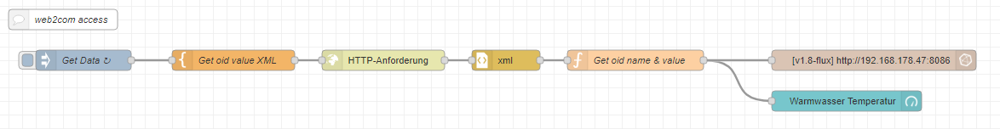
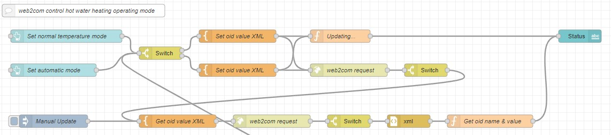

# web2com
## Get data from web2com in Node-RED

With this flow it is possible to get data via web2com from the heat pump.
The example shows how to read the hot water temperature.

The ID of the parameter to be read from the web2com must be adapated in the function block "Get oid value XML" marked with oid in line 8.

## Set data to web2com in Node-RED

With this flow it is possible to set data via web2com for the heat pump.
The example shows how to set the hot water heating operating mode.

